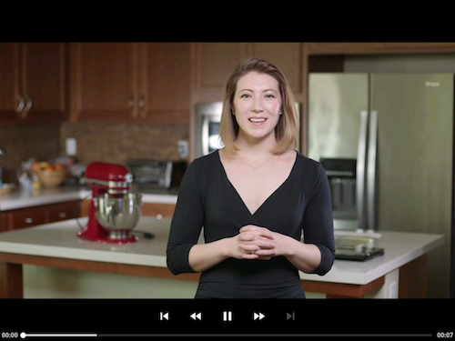

# D'Baker
An app to that allows a user to select a recipe and see video-guided steps for how to complete it.

This app is the final project in the **Associate Android Developer Fast Track** course offered by [Udacity](https://udacity.com) & **Google** courtesy of [Andela](https://andela.com).

 

#### Required Tasks
1. App should display recipes from provided network resource.
2. App should allow navigation between individual recipes and recipe steps.
3. App uses RecyclerView and can handle recipe steps that include videos or images.
4. Application uses Exoplayer to display videos.
5. Application uses Master Detail Flow to display recipe steps and navigation between them.
6. Application properly initializes and releases video assets when appropriate.
7. Application should properly retrieve media assets from the provided network links. It should properly handle network requests.
8. Application sensibly utilizes a third-party library to enhance the app's features. That could be helper library to interface with ContentProviders if you choose to store the recipes, a UI binding library to avoid writing findViewById a bunch of times, or something similar.
9. Application sensibly utilizes a third-party library to enhance the app's features. That could be helper library to interface with ContentProviders if you choose to store the recipes, a UI binding library to avoid writing findViewById a bunch of times, or something similar.
10. Application has a companion homescreen widget.
11. Widget displays ingredient list for desired recipe.